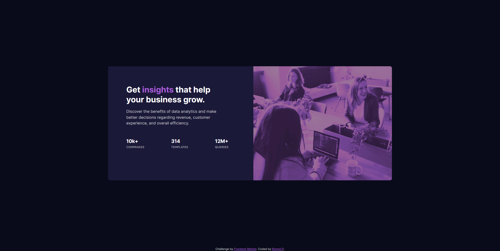

# Frontend Mentor - Stats preview card component solution



This is my solution to the [Stats preview card component challenge](https://www.frontendmentor.io/challenges/stats-preview-card-component-8JqbgoU62) on [Frontend Mentor](https://www.frontendmentor.io).

## Table of contents

- [Overview](#overview)
  - [The challenge](#the-challenge)
  - [Screenshot](#screenshot)
  - [Links](#links)
- [My process](#my-process)
  - [Built with](#built-with)
  - [What I learned](#what-i-learned)
  - [Continued development](#continued-development)
  - [Useful resources](#useful-resources)
- [Author](#author)
- [Acknowledgments](#acknowledgments)

## Overview

### Requirements

- It should be responsive

### Links

- Solution URL: [GitHub repository](https://github.com/RonnyPumaricra/order-summary-component)
- Live Site URL: [Watch it live](https://ronnypumaricra.github.io/stats-preview-card-component)

## My process

### Built with

- HTML5
- CSS variables (custom properties)
- Flexbox

### Highlights

It is used a styled `strong` tag to highlight text in HTML:

```html
<h1>Get <strong>insights</strong> that help your business grow.</h1>

<ul>
  <li><strong>10k+</strong> COMPANIES</li>
</ul>
```


To get the image with a purple-like tone, it is used the following code:

```css
.card-header img {
  filter: contrast(65%) sepia(100%) saturate(344%) hue-rotate(228deg) brightness(60%);
}
```

## Author

- Frontend Mentor - [@RonnyPumaricra](https://www.frontendmentor.io/profile/RonnyPumaricra)
